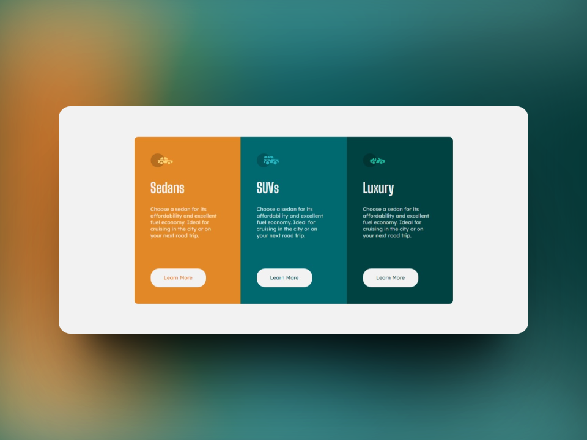
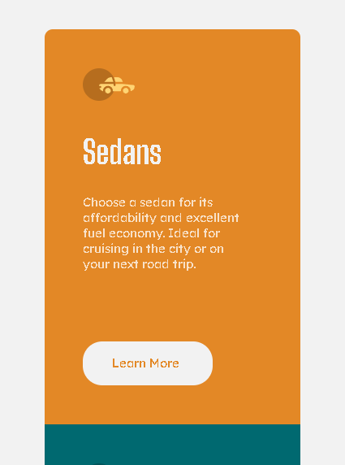

# Frontend Mentor - 3-column preview card component solution

This is a solution to the [3-column preview card component challenge on Frontend Mentor](https://www.frontendmentor.io/challenges/3column-preview-card-component-pH92eAR2-). Frontend Mentor challenges help you improve your coding skills by building realistic projects. 

## Table of Contents

- [Overview](#overview)
  - [The Challenge](#the-challenge)
  - [Screenshots](#screenshots)
  - [Links](#links)
- [My Process](#my-process)
  - [Built With](#built-with)
  - [What I Learned](#what-i-learned)
  - [Continued Development](#continued-development)
  - [Useful resources](#useful-resources)
- [Author](#author)

## Overview

### The Challenge

Users should be able to:

- View the optimal layout depending on their device's screen size
- See hover states for interactive elements

### Screenshots   



*Desktop Screenshot*



*Mobile Screenshot*

### Links

- Live Site URL: [Live site](https://ezequiel-sk.github.io/3-column-preview-card-component/)
- Solution URL: [Source code](https://github.com/Ezequiel-sk/3-column-preview-card-component)

## My process

### Built with

- Semantic HTML5 markup
- Flexbox
- SCSS
  - variables
  - partials
- Media Query

### What I learned

* I learned a bit about responsive design with media queries:

     ```scss
    @media (max-width: 425px) {
        .container {
            display: flex;
            flex-direction: column;
            margin: 5.5rem 0;
        }
    }
    ````
      
    > This media query is only for mobile design.
     
* Separate code into Sass partials and import them into the main style file:

  ```scss
    // Import web page reset partials, Sass style variables, and media queries.
      
    @import "partials/var";
    @import "partials/reset";
    @import "partials/media-query";
  
  ```

### Useful resources

- [Reset Pro](https://github.com/eduardofierropro/Reset-CSS) - A comprehensive browser reset created by YouTuber [Eduardofierropro](https://www.youtube.com/watch?v=Foieq2jTajE)


### Continued development

I would like to focus a little more on the **adaptive designs** of web pages.

## **Author**

- Frontend Mentor - *[@Ezequiel Sk](https://www.frontendmentor.io/profile/Leandro-smiak)*
