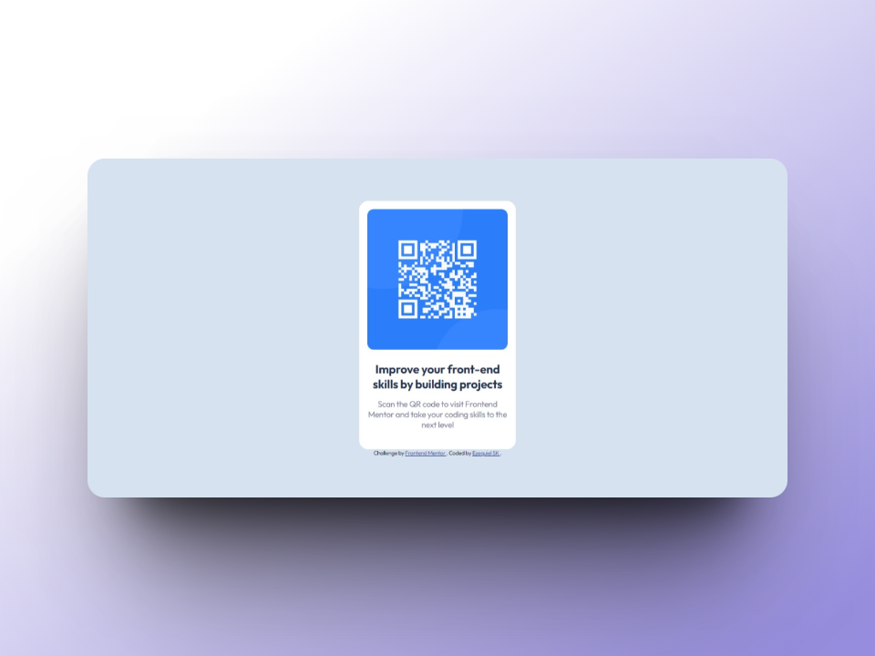

# QR code component | challenge by frontend Mentor

## Table of contents

- [Overview](#overview)
  - [Screenshot](#screenshot)
  - [Links](#links)
- [Built With](#built-with)
- [What I Learned](#what-i-learned)
- [Resources](#resources)
- [Author](#author)

## Overview

### Screenshot



### Links

- Live Site URL: [QR-code-component](https://ezequiel-sk.github.io/QR-code-component/)

## Built With

- Semantic HTML5 markup
- SCSS preprocessor
- Flexbox

### What I learned

Though the challenge wasn't too difficult, I gained some knowledge about using Sass/SCSS partials to organize code and separate variables and browser resets.

### For example, I exported partials for browser reset and variables:


```scss
@import "partials/style-var";
@import "partials/reset";

```

### Variables partial:

```scss
// Colors

$White          : hsl(0, 0%, 100%);
$Light-gray     : hsl(212, 45%, 89%);
$Grayish-blue   : hsl(220, 15%, 55%);
$Dark-blue      : hsl(218, 44%, 22%);

// Font

$Family         : 'Outfit', sans-serif;
```

### Browser reset partial:

``` scss
*,
  *::before,
  *::after {
      margin: 0;
      padding: 0;
      border: 0;
      box-sizing: border-box;
      vertical-align: baseline;
  }

  /* ... */
```

## Resources

- [Reset Pro](https://github.com/eduardofierropro/Reset-CSS) - A comprehensive browser reset created by YouTuber [Eduardofierropro](https://www.youtube.com/watch?v=Foieq2jTajE)

## Author

- Frontend Mentor - [@Ezequiel-Sk](https://www.frontendmentor.io/profile/Leandro-smiak)
