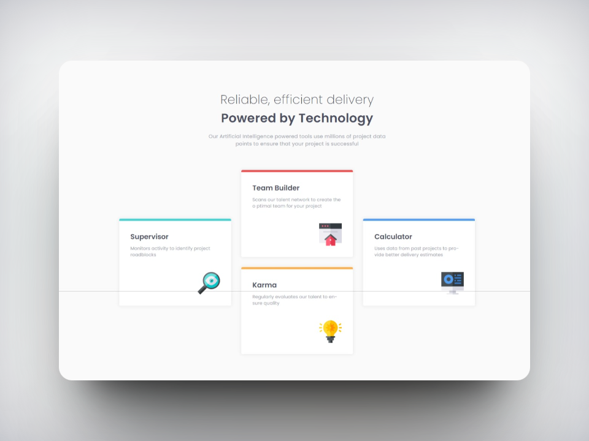

# Frontend Mentor - Four Card Feature Section Solution

This repository contains my solution to the [Four Card Feature Section challenge on Frontend Mentor](https://www.frontendmentor.io/challenges/four-card-feature-section-weK1eFYK). Frontend Mentor challenges provide practical projects to enhance your coding skills.

## Table of Contents

- [Overview](#overview)
  - [The Challenge](#the-challenge)
  - [Screenshots](#screenshots)
  - [Links](#links)
- [My Process](#my-process)
  - [Built With](#built-with)
  - [What I Learned](#what-i-learned)
  - [Useful Resources](#useful-resources)
  - [Future Goals](#future-goals)
- [Author](#author)

## Overview

### The Challenge

The main goal of this challenge was to create a responsive layout that looks visually appealing on different screen sizes.

### Screenshots

*Desktop Screenshot*

*Mobile Screenshot*

### Links

- Live Site URL: [Live Site](https://ezequiel-sk.github.io/four-card-feature-section-master/)
- Solution URL: [Source Code](https://github.com/Ezequiel-sk/four-card-feature-section-master)

## My Process

### Built With

- Semantic HTML5 markup
- Flexbox
- SCSS
  - Variables
  - Partials
- Media Queries

### What I Learned

While working on this front-end challenge, I didn't encounter completely new concepts; nevertheless, it was my first experience designing a full page layout instead of individual cards. This challenge allowed me to reinforce my understanding of Flexbox in CSS, which I had previously learned from other projects.

### Continued Development

I intend to continue tackling front-end challenges to further refine my knowledge in this area and consistently practice my programming skills.

### Useful Resources

- [Reset Pro](https://github.com/eduardofierropro/Reset-CSS) - A comprehensive browser reset created by YouTuber [Eduardofierropro](https://www.youtube.com/watch?v=Foieq2jTajE)

### Future Goals

In my upcoming projects, I plan to concentrate more on perfecting **responsive and adaptive web design**.

## Author

- Frontend Mentor - [@Ezequiel Sk](https://www.frontendmentor.io/profile/Leandro-smiak)
