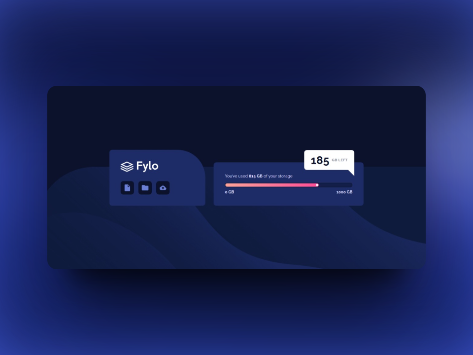
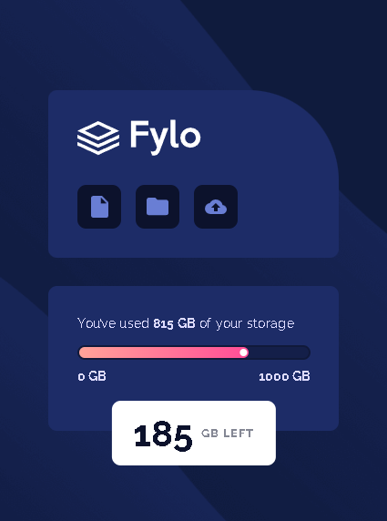

# Frontend Mentor - Fylo data storage component solution

This is a solution to the [Fylo data storage component challenge on Frontend Mentor](https://www.frontendmentor.io/challenges/fylo-data-storage-component-1dZPRbV5n). Frontend Mentor challenges help you improve your coding skills by building realistic projects. 

## Table of contents

- [Overview](#overview)
  - [The Challenge](#the-challenge)
  - [Screenshots](#screenshots)
  - [Links](#links)
- [My Approach](#my-approach)
  - [Technologies Used](#technologies-used)
  - [Key Learnings](#key-learnings)
  - [Code Snippets](#code-snippets)
- [Future Improvements](#future-improvements)
- [Useful Resources](#useful-resources)
- [Author](#author)

## Overview

### The challenge

Users should be able to:

- View the optimal layout for the site depending on their device's screen size

### Screenshots

*Desktop Screenshot*

*Mobile Screenshot*

### Links

- [Live Site](https://ezequiel-sk.github.io/fylo-data-storage-component-master/)
- [Source Code](https://github.com/Ezequiel-sk/fylo-data-storage-component-master)

## My process

### Built with

- Semantic HTML5 markup
- Flexbox
- SCSS (Sass)
  - Variables
  - Partials
  - browser reset
- Media Queries

### What I learned

In this challenge, despite its greater complexity compared to the previous ones, I did not acquire new knowledge. However, I managed to consolidate my skills and hone my understanding of element placement using properties like `position: absolute;`, `position: fixed;` and `position: relative;`. 

Even so, I must admit that these properties have presented me with certain challenges during the execution of this project.

### Future Improvements

Going ahead with the **JUNIOR** level challenges in the field of front-end development will allow me to strengthen my skills and further hone my capabilities in this area.

### Useful Resources

- [Reset Pro](https://github.com/eduardofierropro/Reset-CSS) - A comprehensive browser reset created by YouTuber [Eduardofierropro](https://www.youtube.com/watch?v=Foieq2jTajE)

### Author

- Frontend Mentor - [@Ezequiel Sk](https://www.frontendmentor.io/profile/Leandro-smiak)