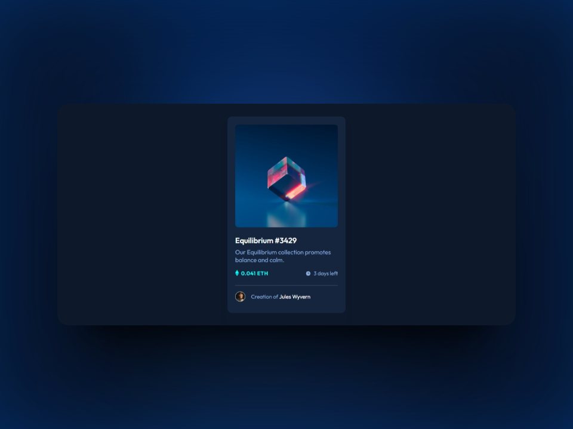

# Frontend Mentor - NFT preview card component solution

This is a solution to the [NFT preview card component challenge on Frontend Mentor](https://www.frontendmentor.io/challenges/nft-preview-card-component-SbdUL_w0U). Frontend Mentor challenges are a great way to improve coding skills by building realistic projects.

## Table of contents

- [Overview](#overview)
  - [The challenge](#the-challenge)
  - [Screenshot](#screenshot)
  - [Links](#links)
- [My process](#my-process)
  - [Built with](#built-with)
  - [What I learned](#what-i-learned)
  - [Continued development](#continued-development)
  - [Useful resources](#useful-resources)
- [Author](#author)

## Overview

### The challenge

The main objectives of this challenge were:

- To create a responsive NFT preview card that adapts to various screen sizes.
- To implement hover states for interactive elements.

### Screenshot



### Links

- Live Site URL: [weblive](https://ezequiel-sk.github.io/NFT-preview-card-component/)

## My process

### Built with

- HTML5
- Flexbox
- SCSS
- variables SCSS

### What I learned

 I included the Favicon in multiple sizes and formats to ensure optimal experiences across various platforms and devices. Here's a sample piece of HTML code with links to different favicon sizes:

```html
<link rel="apple-touch-icon" sizes="180x180" href="asset/favicon/apple-touch-icon.png">
<link rel="icon" type="image/png" sizes="32x32" href="asset/favicon/favicon-32x32.png">
<link rel="icon" type="image/png" sizes="16x16" href="asset/favicon/favicon-16x16.png">
<!-- .... -->
```

Lastly, I used Autoprefixer to add necessary vendor prefixes to CSS properties, enhancing cross-browser compatibility:

```css
.main__section-container {
  display: -webkit-box;
  display: -ms-flexbox;
  display: flex;
  -webkit-box-pack: justify;
  -ms-flex-pack: justify;
          justify-content: space-between;
  -webkit-box-align: center;
  -ms-flex-align: center;
          align-items: center;
  margin-bottom: 1.2rem;
}
```

### Continued development

> For future projects, I plan to focus on improving accessibility and optimizing website performance to deliver a better user experience.

### Useful resources

- [Reset Pro](https://github.com/eduardofierropro/Reset-CSS) - A comprehensive browser reset created by YouTuber [Eduardofierropro](https://www.youtube.com/watch?v=Foieq2jTajE)

## Author

- Frontend Mentor - [@Ezequiel-Sk](https://www.frontendmentor.io/profile/Leandro-smiak)
