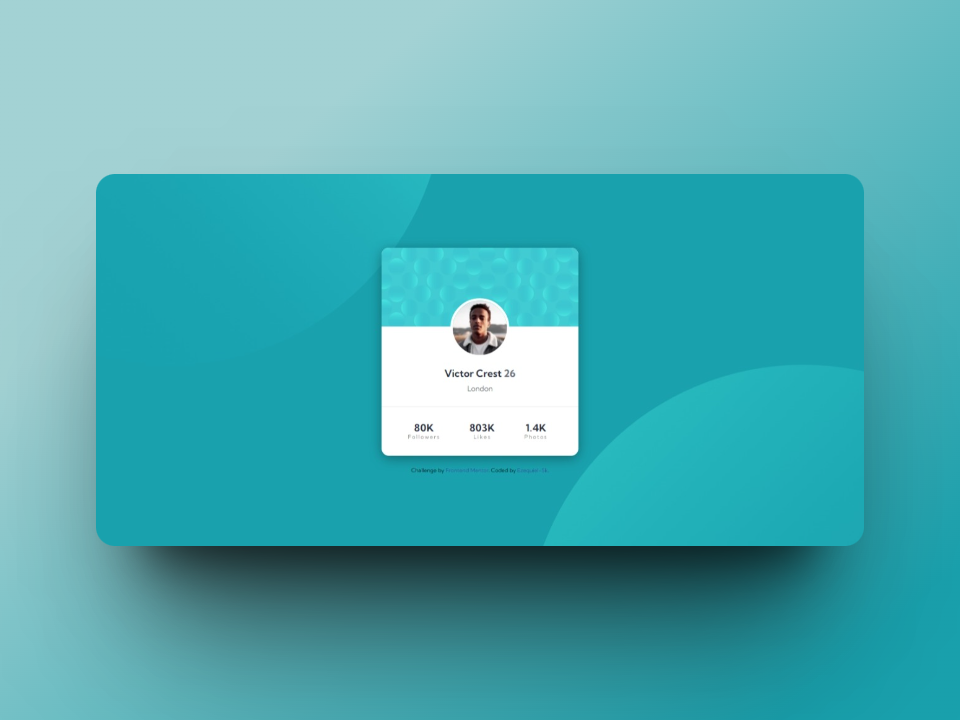

# Frontend Mentor - Profile card component solution

This is a solution to the [Profile card component challenge on Frontend Mentor](https://www.frontendmentor.io/challenges/profile-card-component-cfArpWshJ). Frontend Mentor challenges are a great way to improve coding skills by building realistic projects.

## Table of contents

- [Overview](#overview)
  - [The challenge](#the-challenge)
  - [Screenshot](#screenshot)
  - [Links](#links)
- [My process](#my-process)
  - [Built with](#built-with)
  - [What I learned](#what-i-learned)
  - [Continued development](#continued-development)
  - [Useful resources](#useful-resources)
- [Author](#author)

## Overview

### The challenge

The challenge was to build the project based on the designs provided.

### Screenshot


*Desktop Screenshot*

### Links

- Live Site URL: [ live site URL here](https://ezequiel-sk.github.io/Profile-card-component/)

## My process

### Built with

- Semantic HTML5 markup
- Flexbox
- SCSS
  - variables
  - partials
- Media Query

### What I learned
By completing this challenge, I reinforced my knowledge of the technologies I used. Also, I learned how to add descriptions meta tag to web pages for SEO purposes. 

Here is the code snippet:

```html
  <head>
    <meta name="description" content="Frontend Mentor Profile card component challenge completed by Ezequiel-Sk">
    <!-- .... -->
  </head>
```

> It's always essential to provide meta descriptions for web pages to improve search engine rankings and help users understand what the page is about.

### Continued development

While this challenge might not have presented significant learning opportunities, I remain committed to continuously improving my skills and knowledge in web development. I plan to keep learning and challenging myself with more complex projects.

### Useful resources

- [Reset Pro](https://github.com/eduardofierropro/Reset-CSS) - A comprehensive browser reset created by YouTuber [Eduardofierropro](https://www.youtube.com/watch?v=Foieq2jTajE)

## Author

- Frontend Mentor - [@Ezequiel-Sk](https://www.frontendmentor.io/profile/Leandro-smiak)
