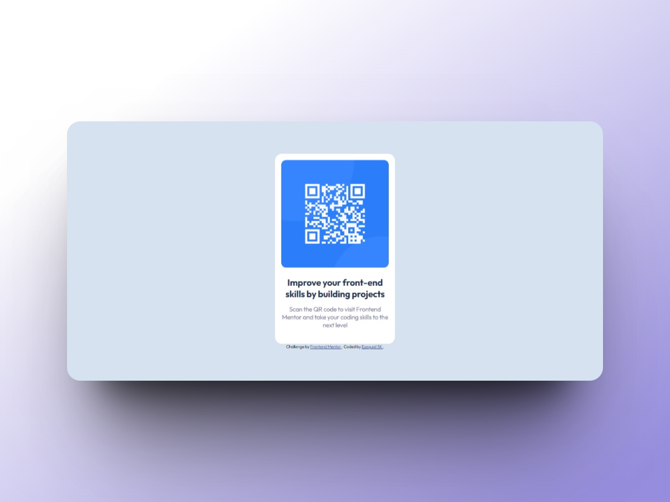
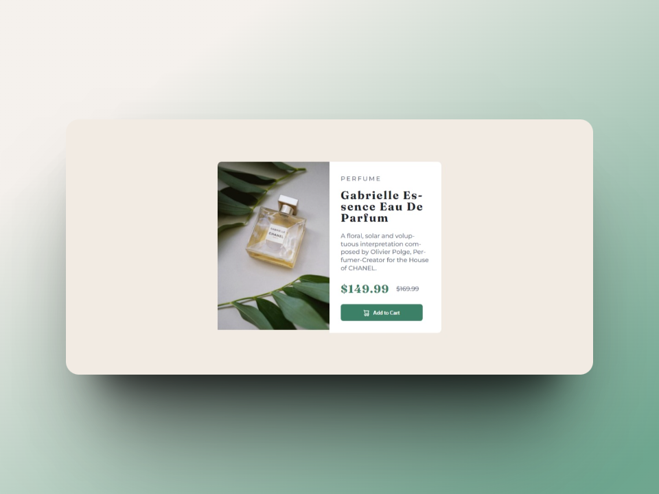
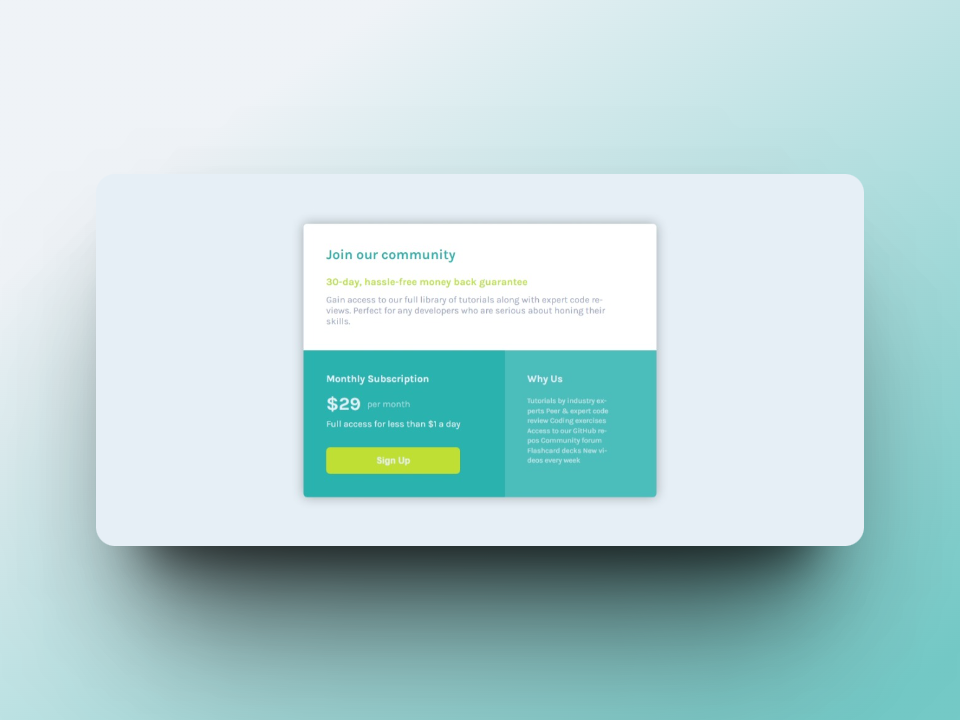
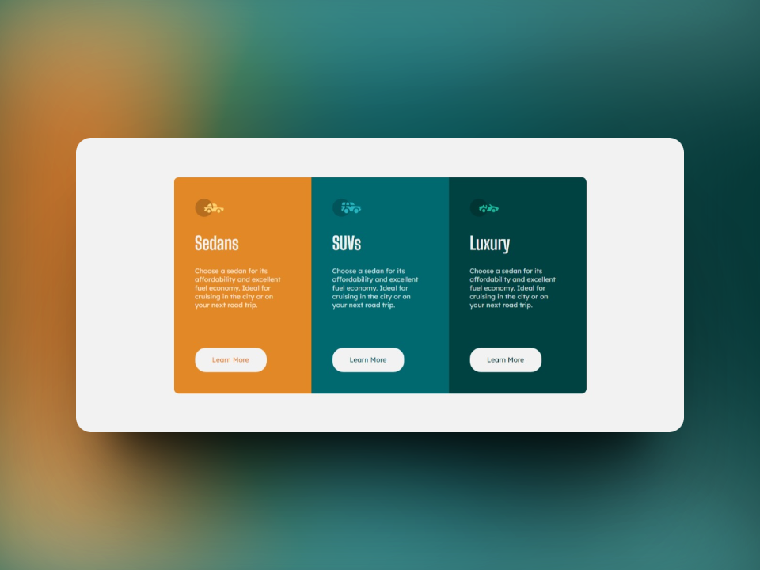
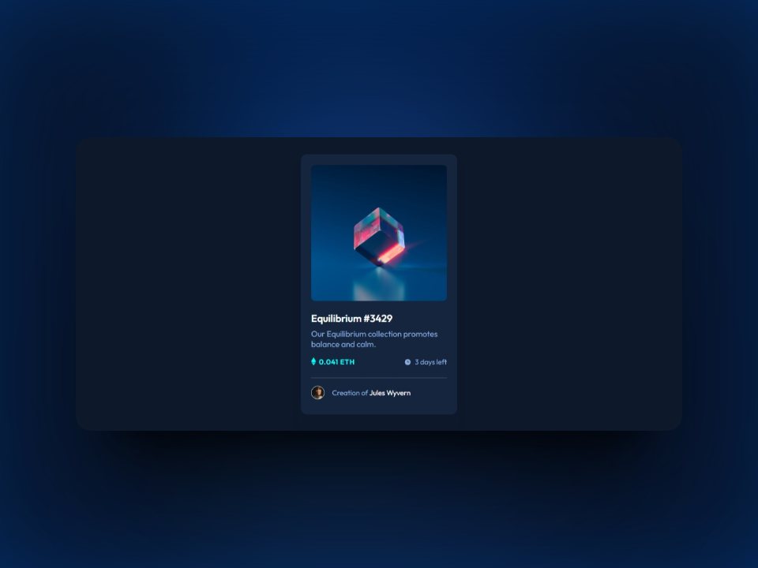
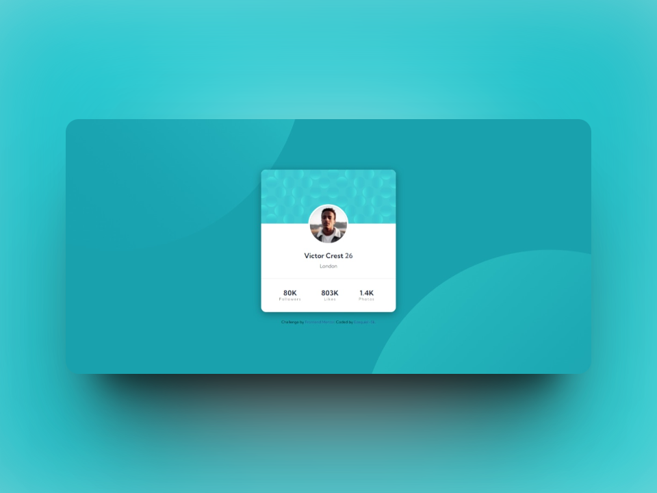
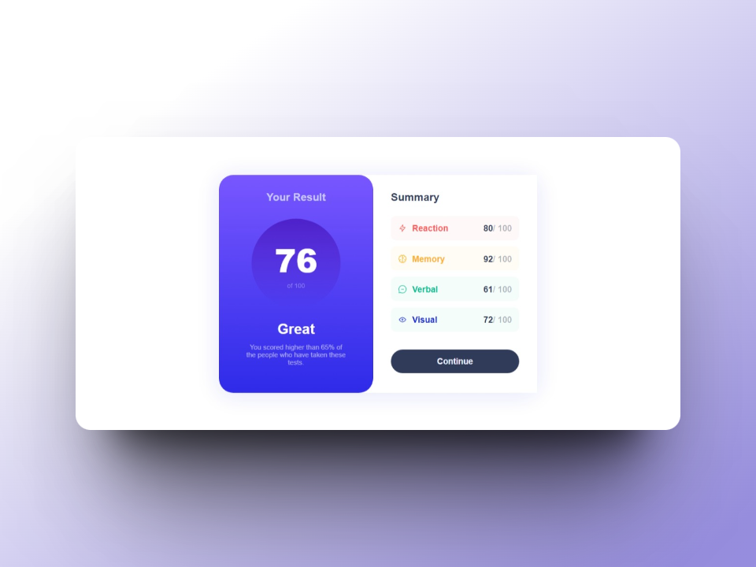
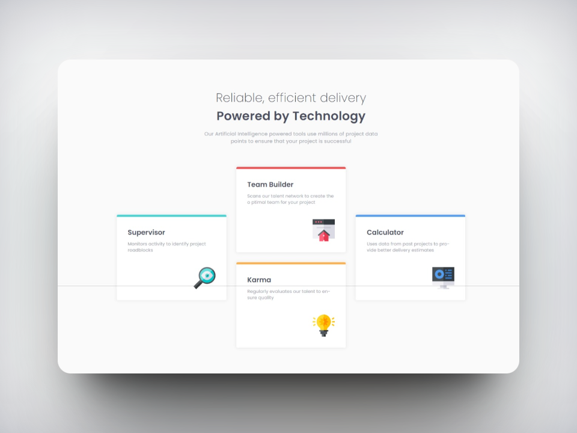
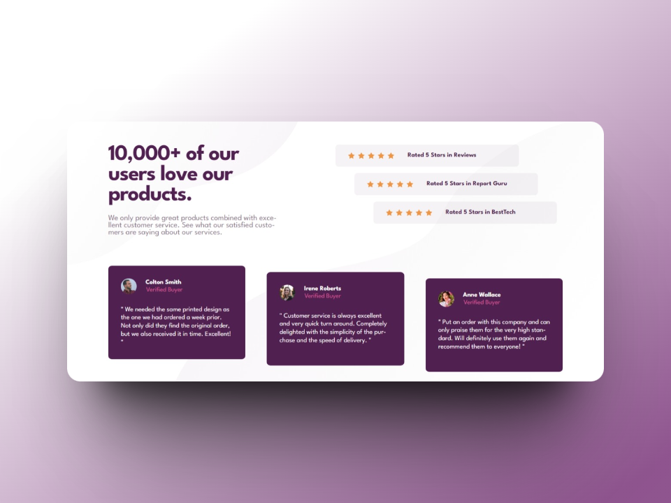
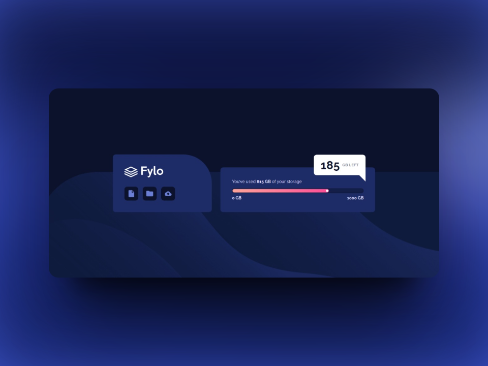

# FrontEnd Mentor Challenges

This repository contains a collection of projects that I have completed in Frontend Mentor. 
Every project is an opportunity to improve my frontend development skills.

### Table of Contents

1. [QR Code Component](#qr-code-component)
2. [Product Preview Card Component](#product-preview-card-component)
3. [Product Preview Card Component](#single-price-grid-component)
4. [3-column preview card component](#3-column-preview-card-component)
5. [NFT preview card component](#nft-preview-card-component)
6. [Profile card component](#profile-card-component)
7. [Results summary component](#results-summary-component)
8. [Stats preview card component](#stats-preview-card-component)
9. [Four card feature section](#four-card-feature-section)
10. [Social proof section](#social-proof-section)
11. [Fylo data storage component](#fylo-data-storage-component)
12. [Testimonials grid section](#testimonials-grid-section)

## QR code component

- **Live Site URL:** [Live Site Link]()
- **Source Code:** [Link to Source Code](./QR-code-component)

## Product preview card component

- **Live Site URL:** [Live Site Link]()
- **Source Code:** [Link to Source Code](./product-preview-card-component)

## Single price grid component

- **Live Site URL:** [Live Site Link]()
- **Source Code:** [Link to Source Code](./single-price-grid-component)

## 3-column preview card component

- **Live Site URL:** [Live Site Link]()
- **Source Code:** [Link to Source Code](./3-column-preview-card-component)

## NFT preview card component

- **Live Site URL:** [Live Site Link]()
- **Source Code:** [Link to Source Code](./nft-preview-card-component)

## Profile card component

- **Live Site URL:** [Live Site Link]()
- **Source Code:** [Link to Source Code](./profile-card-component)

## Results summary component

- **Live Site URL:** [Live Site Link]()
- **Source Code:** [Link to Source Code](./results-summary-component)

## Stats preview card component

- **Live Site URL:** [Live Site Link]()
- **Source Code:** [Link to Source Code](./stats-preview-card-component)

## Four card feature section

- **Live Site URL:** [Live Site Link]()
- **Source Code:** [Link to Source Code](./four-card-feature-section)

## Social proof section

- **Live Site URL:** [Live Site Link]()
- **Source Code:** [Link to Source Code](./social-proof-section)

## Fylo data storage component

- **Live Site URL:** [Live Site Link]()
- **Source Code:** [Link to Source Code](./fylo-data-storage-component)

## Testimonials grid section

- **Live Site URL:** [Live Site Link]()
- **Source Code:** [Link to Source Code](./testimonials-grid-section)

## Author

Frontend Mentor - [@Ezequiel-Sk](https://www.frontendmentor.io/profile/Leandro-smiak)