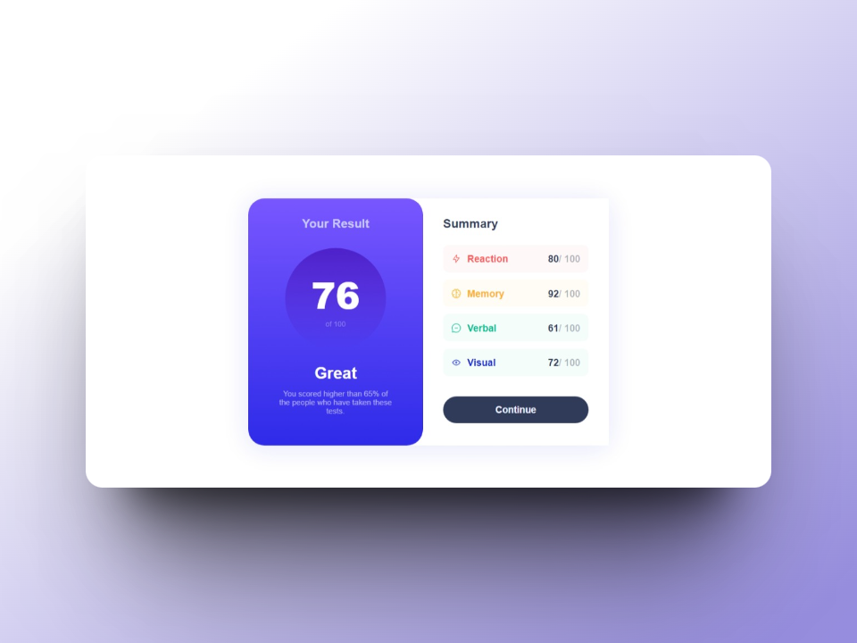
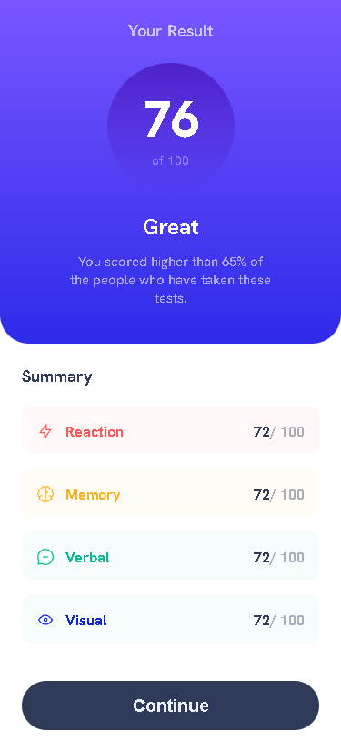

# Frontend Mentor - Results summary component solution

This is a solution to the [Results summary component challenge on Frontend Mentor](https://www.frontendmentor.io/challenges/results-summary-component-CE_K6s0maV). Frontend Mentor challenges help you improve your coding skills by building realistic projects. 

## Table of contents

- [Overview](#overview)
  - [The Challenge](#the-challenge)
  - [Screenshots](#screenshots)
  - [Links](#links)
- [My Process](#my-process)
  - [Built With](#built-with)
  - [What I Learned](#what-i-learned)
  - [Continued Development](#continued-development)
  - [Useful resources](#useful-resources)
- [Author](#author)

## Overview

### The challenge

Users should be able to:

- View the optimal layout for the interface depending on their device's screen size
- See hover and focus states for all interactive elements on the page

### Screenshot

*Desktop Screenshot*

*Mobile Screenshot*

### Links

- Live Site URL: [Live site](https://ezequiel-sk.github.io/Results-summary-component/)
- Solution URL: [Source code](https://github.com/Ezequiel-sk/Results-summary-component)

## My process

### Built with

- Semantic HTML5 markup
- Flexbox
- SCSS
  - variables
  - partials
- Media Query

### What I learned

During this challenge, although I did not learn many new things, although I can reinforce my previous knowledge.

### Useful resources

- [Reset Pro](https://github.com/eduardofierropro/Reset-CSS) - A comprehensive browser reset created by YouTuber [Eduardofierropro](https://www.youtube.com/watch?v=Foieq2jTajE)

### Continued development

keep learning *web development*

## *Author*

- Frontend Mentor - *[@Ezequiel Sk](https://www.frontendmentor.io/profile/Leandro-smiak)*

