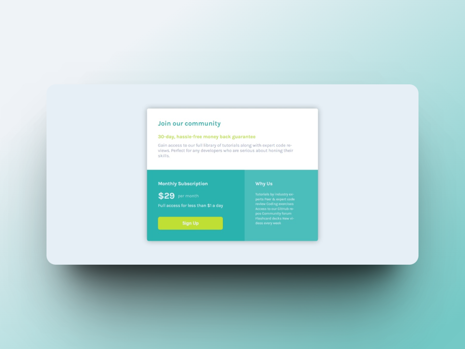

# Frontend Mentor - Single price grid component solution

This is a solution to the [Single price grid component challenge on Frontend Mentor](https://www.frontendmentor.io/challenges/single-price-grid-component-5ce41129d0ff452fec5abbbc). Frontend Mentor challenges help you improve your coding skills by building realistic projects. 

## Table of contents

- [Overview](#overview)
  - [The challenge](#the-challenge)
  - [Screenshot](#screenshot)
  - [Links](#links)
- [My process](#my-process)
  - [Built with](#built-with)
  - [What I learned](#what-i-learned)
  - [Continued development](#continued-development)
  - [Useful resources](#useful-resources)
- [Author](#author)

## Overview

### The challenge

Users should be able to:

- View the optimal layout for the component depending on their device's screen size
- See a hover state on desktop for the Sign Up call-to-action

### Screenshot




*Desktop Screenshot*


*Mobile Screenshot*

### Links

- Live Site URL: [Live site](https://ezequiel-sk.github.io/Single-price-grid-component/)
- Solution URL: [Source code](https://ezequiel-sk.github.io/Single-price-grid-component/)

## My process

### Built with

- Semantic HTML5 markup
- CSS GRID
- SCSS
  - variables
  - partials
- Media Query

### What I learned

This challenge was the first time I used CSS Grid. I learned how to structure a layout using "grid-template-areas" and assign specific areas to elements using "grid-area".

```scss
  .main {
    display: grid;
    grid-template-areas: 
    "grid-1 grid-1"
    "grid-2 grid-3";

    &__gdo {
      grid-area: grid-1;
    }

    &__gdtw {
      grid-area: grid-2;
    }

    &__gdt {
      grid-area: grid-3;
    }
  }
```

### Continued development

I will continue to solve more challenges to improve as a programmer and gain more experience working with different layouts and design patterns.

### Useful resources

- [Reset Pro](https://github.com/eduardofierropro/Reset-CSS) - A comprehensive browser reset created by YouTuber [Eduardofierropro](https://www.youtube.com/watch?v=Foieq2jTajE)


### Continued development

I would like to focus a little more on the **adaptive designs** of web pages.

## **Author**

- Frontend Mentor - *[@Ezequiel Sk](https://www.frontendmentor.io/profile/Leandro-smiak)*