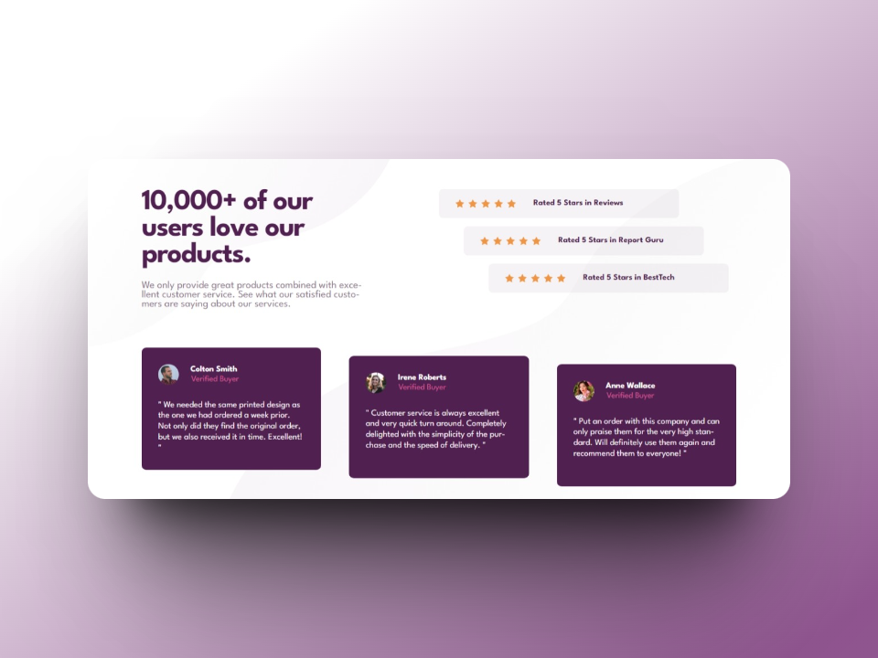
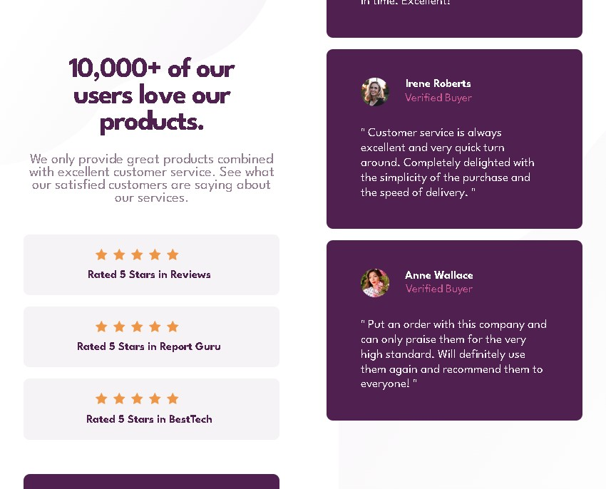

# Frontend Mentor - Social Proof Section Solution

This repository contains my solution to the [Social Proof Section challenge on Frontend Mentor](https://www.frontendmentor.io/challenges/social-proof-section-6e0qTv_bA). Frontend Mentor challenges are a fantastic way to enhance your coding skills by building practical projects.

## Table of Contents

- [Overview](#overview)
  - [The Challenge](#the-challenge)
  - [Screenshots](#screenshots)
  - [Links](#links)
- [My Approach](#my-approach)
  - [Technologies Used](#technologies-used)
  - [Key Learnings](#key-learnings)
  - [Code Snippets](#code-snippets)
- [Future Improvements](#future-improvements)
- [Useful Resources](#useful-resources)
- [Author](#author)

## Overview

### The Challenge

The goal of this challenge was to create a responsive social proof section that adapts seamlessly to various screen sizes.

### Screenshots


*Desktop Screenshot*


*Mobile Screenshot*

### Links

- [Live Site](https://ezequiel-sk.github.io/Social-proof-section/)
- [Source Code](https://github.com/Ezequiel-sk/Social-proof-section)

## My Approach

### Technologies Used

- Semantic HTML5 markup
- Flexbox
- CSS Grid
- SCSS (Sass)
  - Variables
  - Partials
  - browser reset
- Media Queries

### Key Learnings

This challenge provided an opportunity to consolidate my skills and tackle a more comprehensive project. Some highlights include:

- Combining `flexbox` and `css grid` for layout management.
- Utilizing the `<q>` tag for customer quotes.
- Enhancing responsiveness using media queries.

### Code Snippets

Here's an example of how I combined `flexbox` and `css grid` for layout management:

```scss
.main {
  display: grid;
  grid-template-columns: 1fr 1fr;
  font-weight: $Bold;

  &__section {
    grid-column: 1 / span 1;

    // ... 
  }

  &__cards {
    display: flex;
    align-items: center;

    &-header {
      display: flex;
      align-items: center;
      text-align: center;

      // ...
    }

    // ...
  }
}
```

And my use of the `<q>` tag for customer quotes:

```html
<q class="main__cards-footer-q">
  "We needed the same printed design as the one we had ordered a week prior.
  Not only did they find the original order, but we also received it in time.
  Excellent!"
</q>
```

### Future Improvements

Completing this challenge marks the end of my journey in the NEWBIE category on Frontend Mentor. I look forward to tackling more complex projects as I progress to the JUNIOR level.

### Useful Resources

- [Reset Pro](https://github.com/eduardofierropro/Reset-CSS) - A comprehensive browser reset created by YouTuber [Eduardofierropro](https://www.youtube.com/watch?v=Foieq2jTajE)

### Author

- Frontend Mentor - [@Ezequiel Sk](https://www.frontendmentor.io/profile/Leandro-smiak)