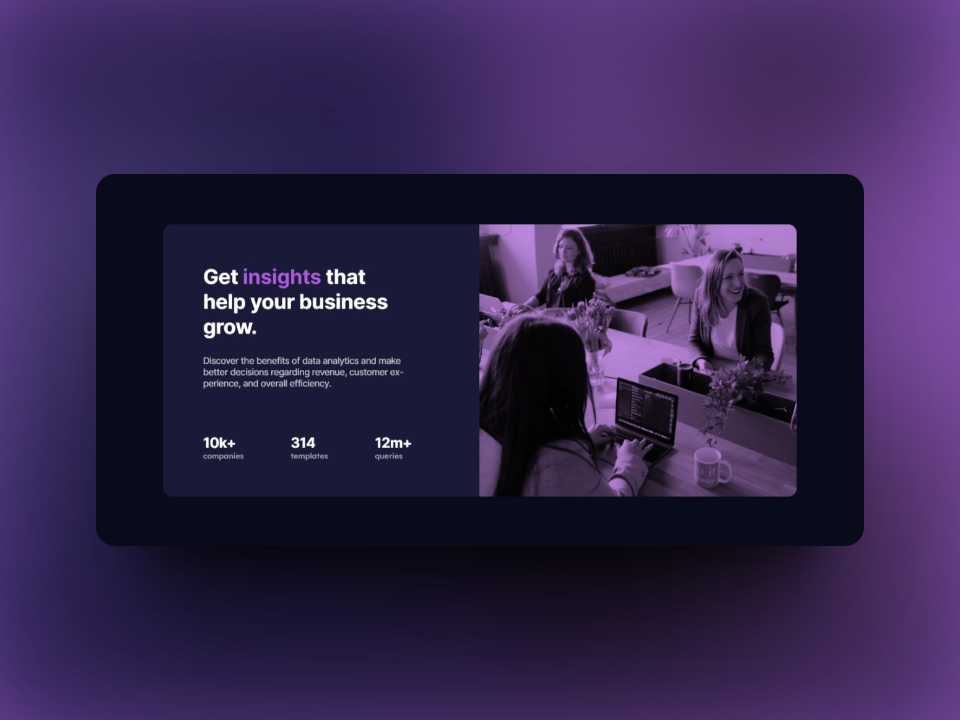

# Frontend Mentor - Stats preview card component solution

This is a solution to the [Stats preview card component challenge on Frontend Mentor](https://www.frontendmentor.io/challenges/stats-preview-card-component-8JqbgoU62). Frontend Mentor challenges help you improve your coding skills by building realistic projects. 

## Table of contents

- [Overview](#overview)
  - [The Challenge](#the-challenge)
  - [Screenshots](#screenshots)
  - [Links](#links)
- [My Process](#my-process)
  - [Built With](#built-with)
  - [What I Learned](#what-i-learned)
  - [Continued Development](#continued-development)
  - [Useful resources](#useful-resources)
- [Author](#author)

## Overview

### The challenge

Users should be able to:

- View the optimal layout depending on their device's screen size

### Screenshots   

### Links

- Live Site URL: [Live site](https://ezequiel-sk.github.io/Stats-preview-card-component/)
- Solution URL: [Source code](https://github.com/Ezequiel-sk/Stats-preview-card-component)

## My process

### Built with

- Semantic HTML5 markup
- Flexbox
- SCSS
  - variables
  - partials
- Media Query

### What I learned

I didn't learn much with this challenge, but it was good to reinforce my knowledge. Although adding the color on top of the image was a bit tricky, I finally managed to do it.

### Continued development

I will continue solving Frontend Mentor challenges to improve my knowledge in frontend development.

### Useful resources

- [Reset Pro](https://github.com/eduardofierropro/Reset-CSS) - A comprehensive browser reset created by YouTuber [Eduardofierropro](https://www.youtube.com/watch?v=Foieq2jTajE)

### Continued development

I would like to focus a little more on the **adaptive designs** of web pages.

## **Author**

- Frontend Mentor - *[@Ezequiel Sk](https://www.frontendmentor.io/profile/Leandro-smiak)*
