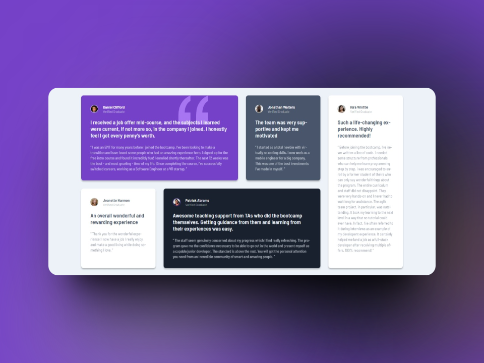
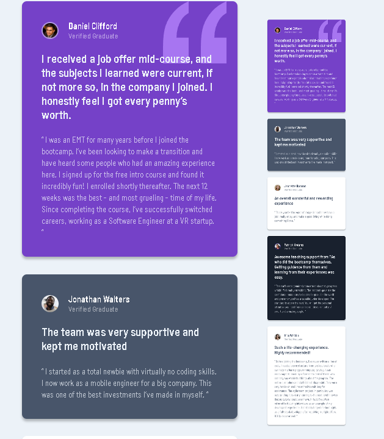

# Frontend Mentor - Testimonials grid section solution

This is a solution to the [Testimonials grid section challenge on Frontend Mentor](https://www.frontendmentor.io/challenges/testimonials-grid-section-Nnw6J7Un7). Frontend Mentor challenges help you improve your coding skills by building realistic projects. 

## Table of contents

- [Overview](#overview)
  - [The Challenge](#the-challenge)
  - [Screenshots](#screenshots)
  - [Links](#links)
- [My Approach](#my-approach)
  - [Technologies Used](#technologies-used)
  - [Key Learnings](#key-learnings)
  - [Code Snippets](#code-snippets)
- [Future Improvements](#future-improvements)
- [Useful Resources](#useful-resources)
- [Author](#author)

## Overview

### The challenge

Users should be able to:

- View the optimal layout for the site depending on their device's screen size

### Screenshot



*Desktop Screenshot*



*Mobile Screenshot*

### Links

- [Live Site](https://ezequiel-sk.github.io/Testimonials-grid-section/)
- [Source Code](https://github.com/Ezequiel-sk/Testimonials-grid-section)

## My process

### Built with

- Semantic HTML5 markup
- Flexbox
- CSS Grid
- SCSS (Sass)
  - Variables
  - Partials
  - browser reset
- Media Queries

### What I learned

During this Menot Frontend Challenge, I had the opportunity to strengthen and improve my skills in advanced use of **CSS Grid** to design and structure the web page.

Here is a snippet of my code in **SCSS**, where I applied the knowledge gained in **CSS Grid**:

``` scss
.main {
    gap: 1.8rem;
    display: grid;
    grid-template-columns: repeat(4, 1fr);

    &__item-1 {
        grid-area: 1 / span 2;
        background-color: $Moderate-violet;
    }

    &__item-2 {
        grid-area: 1 / span 1;
        background-color: $Very-dark-grayish-blue;
    }

    // ... (more styles and grid elements)
}
```

This challenge allowed me to solidify my understanding of how to effectively manipulate the columns and rows within a grid, controlling the areas assigned to each element. Also, by focusing on the visual design and structure of the page, I was able to reinforce previous concepts and improve my focus on performance optimization.

While no completely new concepts were introduced during this challenge, I find reinforcing my existing knowledge equally important to building a strong foundation in front-end development. Continue advancing in my learning path and apply this knowledge in future projects.

### Future Improvements

Completing this challenge marks the end of my journey in the NEWBIE category on Frontend Mentor. I look forward to tackling more complex projects as I progress to the JUNIOR level.

### Useful Resources

- [Reset Pro](https://github.com/eduardofierropro/Reset-CSS) - A comprehensive browser reset created by YouTuber [Eduardofierropro](https://www.youtube.com/watch?v=Foieq2jTajE)

### Author

- Frontend Mentor - [@Ezequiel Sk](https://www.frontendmentor.io/profile/Leandro-smiak)
